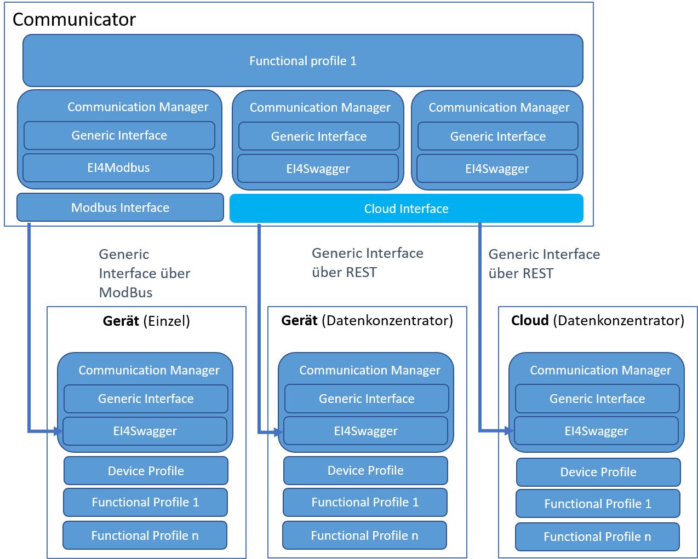

# [DRAFT] InterfaceFactory - Documentation for Developer

This documentation is aimed at SmartGrid ready internal developer.

## Getting Started

To start development for Smartgrid Ready and create your first external interface:

1. Install Eclipse Modeling Framework (EMF) [instructions](https://www.eclipse.org/modeling/emf/gettingstarted.php)
2. Setup Eclipse to work with SmartGrid ready components [instructions](pdfs/Eclipse_Config_CDO_GIT.pdf)
3. TBD

## Overview of involved modules

## Glossary

| Abbreviation | Name                    | Description                                                  | Example |
| ------------ | ----------------------- | ------------------------------------------------------------ | ------- |
| CEM          | Customer Energy Manager | The Customer Energy Manager coordinates the flexibility of an energy system on the customer side and is a software which can be installed anywhere in the system (cloud, devices, head end computer systems) | TBD     |
| EI           | External Interface      | Defines the interface to an external device including communication interface. They are usually provided by the manufacturer of the products. | TBD     |
| FP           | Functional Profile      | These are a modular system of functions which are available as a function block in a class library (programming in a high-level language) or a graphic programming language (freely programmable controllers). | TBD     |
| GI           | Generische Inteface     | TBD                                                          | TBD     |
| RM           | Ressource Manager       | Resource managers are software data translators or gateways which map an external device or an external subsystem of devices to the SmartGrid ready&reg; interface. Resource managers can automatically interpret the machine-readable interfaces of a specific manufacturers. | TBD     |
|              |                         |                                                              |         |

