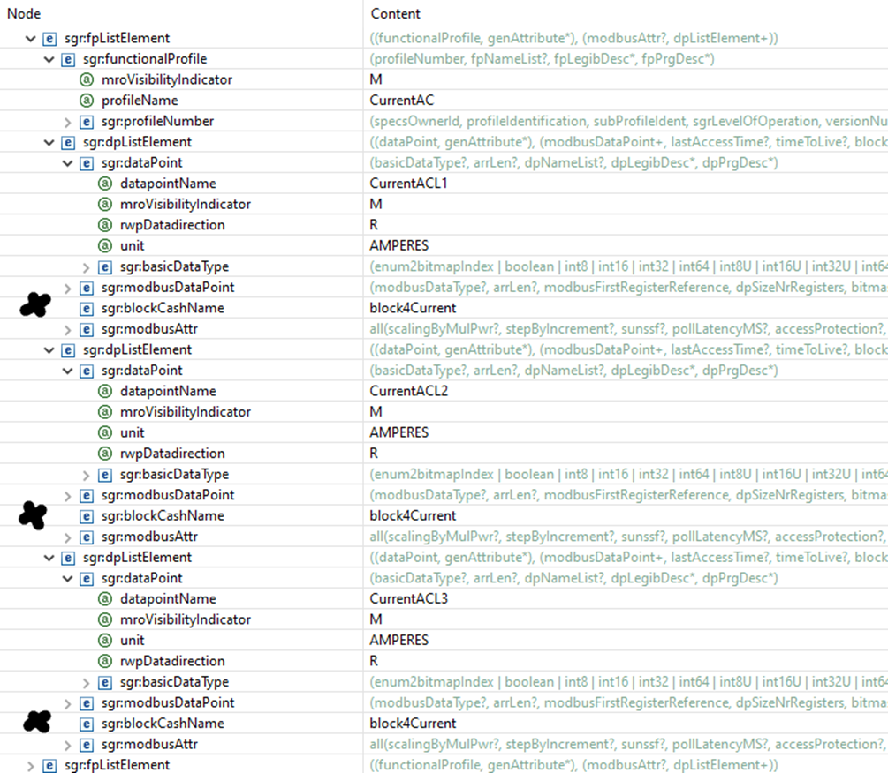

# CommHandler4Modbus - Blocktransfer Implementation

## General description
Modbus blocktransfer is a feature that improves the performance of the modbus communication.
Instead of reading a single value from the device, blocktransfer will read several values (block of values)
from the device. The values are cached within the comm-handler for a given amount of time-to-live. 
So whenever the client (communicator) reads one of the cached values no modbus communication is needed. 
<p>
Example: we want do read the currents 'CurrentACL1', 'CurrentACL2' and 'CurrentACL2'. The communicator 
calls: 
<ol> 
<li>getVal(...,'CurrentACL1)</li>
<li>getVal(...,'CurrentACL2)</li>
<li>getVal(...,'CurrentACL3)</li>
</ol>
However with the first call to getVal(...,'CurrentACL1') the values for L2 and L3 are read from the modbus
too.
<ol>
<li>ReadHoldingRegister( ACL1, ACL2, ACL3)  // <i>pseudocode</i></li>
</ol>
The values read are then stored in the comm-handler cache for later use. The blocktransfer can be configured within
external interface XML of the device.

## Blocktransfer configuration.
<b>Figure 1 and 2</b> show how blocktransfer is configured whtin the EI-XML (external-interface XML):

<b>Step 1:</b> Define an sgr:timeSyncBlockNotification element below the sgr:SGrModbusDeviceFrame element (marked blue and yellow):

<i>Figure 1: Definition of blocks for blocktransfer.</i>
The block transfer is configured as follows:
<table>
    <tr><th>Element</th><th>Description</th><th>Example value</th></tr>
    <tr><td>sgr:blockCashName</td><td>The name of the block. This name will be referenced from the datapoints.</td><td>block4Current</td></tr>
    <tr><td>sgr:timeToLive</td><td>Time in ms, for how long the values are kept in the cache before a new modbus read is done</td><td>2000</td></tr>
    <tr><td>sgr:firstAddr</td><td>Address of the first register/value within the block.</td><td>212</td></tr>
    <tr><td>sgr:size</td><td>The number of (16bit) blocks to be read. The number of blocks being read must be consistent
            with the datapoints read from the device. Example: If the current values for L1/L2/L3 are 32bit floats in 3
            subsequent 16bit registers we need to read 6 blocks.</td><td>6</td></tr>
    <tr><td>sgr:registerType</td><td>The type of the registers.</td><td>HoldRegister</td></tr>
</table>

<b>Step 2:</b> Add datapoint members to the block.
Adding the datapoints by adding a <b>sgr:blockCashName</b> element to the <b>sgr:dpListElement</b> of the respective datapoint.
(marked with a big black X)


<i>Figure 2: Adding datapoints a transfer block.</i>

## Using within the Communicator
The blocktransfer feature is completely transparent to the commhandler client. The client calls
'getVal()', 'getValByGDPType()' etc. as before. The caching mechanism operates in the background.
If you enable the DEBUG logs for the CommHandler4Modbus you can watch the cache being involved:
```
// Call Garo-Wallbox
fVal1 = devGaroWallbox.getValByGDPType("CurrentAC", "CurrentACL1").getFloat32();
fVal2 = devGaroWallbox.getValByGDPType("CurrentAC", "CurrentACL2").getFloat32();
fVal3 = devGaroWallbox.getValByGDPType("CurrentAC", "CurrentACL3").getFloat32();
```
Log output:
```
[main] DEBUG c.i.SGrModbusDevice - Reading time sync block from modbus device (read CurrentACL1)
[main] DEBUG c.i.SGrModbusDevice - Reading time sync block from cache. (read CurrentACL2)
[main] DEBUG c.i.SGrModbusDevice - Reading time sync block from cache. (read CurrentACL3)
```

## SGrModbusDevice code
The following code snippet shows the cache implementation for the block transfer.
```
// Search the block related to the datapoint withing the cache 
CacheRecord<ModbusReaderResponse> mbCacheRecord = myTimeSyncBlockReadCache.get(blockNotificationType);

ModbusReaderResponse mbResponse;
if (mbCacheRecord == null || mbCacheRecord.isExpired(blockNotificationType.getTimeToLive())) 
{   // we have no cache record or the record is expired.
	LOG.debug("Reading time sync block from modbus device");
	mbResponse = ModbusReader.read(
				drv4Modbus,
				blockNotificationType.getRegisterType(),
				blockAddress.intValue(),
				modbusInterfaceDesc.isFirstRegisterAddressIsOne(),
				blockNotificationType.getSize());
				
    if (blockNotificationType.isSetTimeToLive()) 
    {   // Cache the value, but only if a time to live is set!
        myTimeSyncBlockReadCache.put(blockNotificationType, new CacheRecord<>(mbResponse, Instant.now()));
    }
} 
else 
{
    // we have a valid record from the cache.
    LOG.debug("Reading time sync block from cache.");
    mbResponse = mbCacheRecord.getValue();
}

// pick the correct value from the received block (calculate address offset)			
int size = aDataPoint.getModbusDataPoint().get(0).getDpSizeNrRegisters();
int[] mbRegResp = mbResponse.getMbregresp(addrDiff.intValue(), size);
boolean[] mbBitResp = mbResponse.getMbbitresp(addrDiff.intValue(), size);

....etc.
```


